# Mario_Synchronous_R2D2
Playing Super Mario Bros using Synchronous Recurrent Replay Distributed DQN (Synchronous version of R2D2). 

## Introduction

My PyTorch Recurrent Replay Distributed DQN (R2D2 PPO) implementation for playing Super Mario Bros (This is [R2D2 paper](https://openreview.net/pdf?id=r1lyTjAqYX)). 

This original R2D2 use Asynchronous version:
* Each worker (using num_envs = 256 workers, also known as 256 actors), learner, and per are separated into individual threads/computers/servers and run independently. 
* Workers clone the model from the learner, run episodes, and push data to the per:
    * Note that worker use worker/actor model (not target model or online model) to select action and calculate PER priority: This model update every 400 environment steps (400 environment steps). This model is older version of online model, but it is updated more frequently than the target model.
* Per receives data push requests and sends the data to the learner. The learner receives data from per and trains the model, sending the model to the worker if a model update request is received. 

With this distributed system, they won't use specific learn-step settings (how many environment steps to learn) but will maintain a ratio of 5 updates/s and 260 environment steps/s/environment. Therefore, the model will be updated every 260/5 = 52 environment steps (if using a synchronous system).

Because I only have one computer, the above setup makes the algorithm run very slowly instead of speeding it up (or maybe my coding is terrible). I have converted R2D2 to a synchronous version (SR2D2). The algorithm will run like A2C or PPO. Using a single model, we will run a vector environment to simultaneously predict actions, execute episodes, and push data to per. The model will be trained every learn-step (4 instead of 52 because 52 training takes too long). I also modified some hyperparameters due to resource limitations and to train faster (see the hyperparameter section below). I also remove worker/actor model because I can use online model to select action and calculate PER priority.

  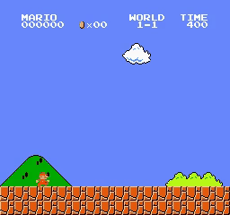
  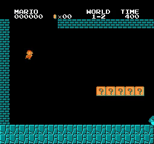
  
  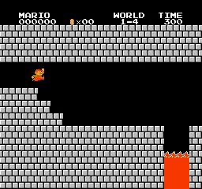 
  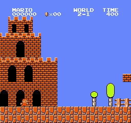
  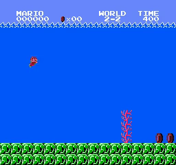
  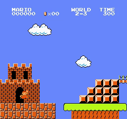
   
  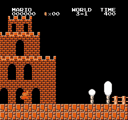
  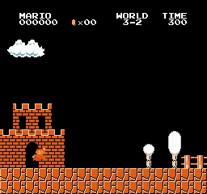
  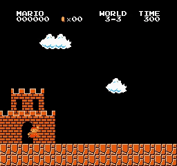
  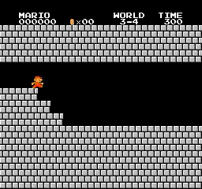 
  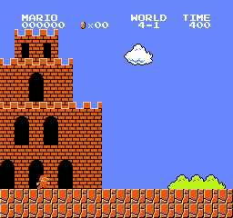
  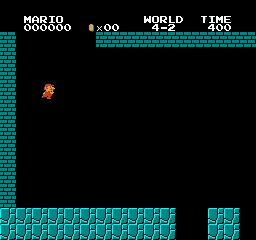
  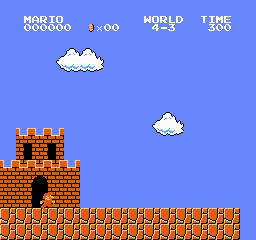
  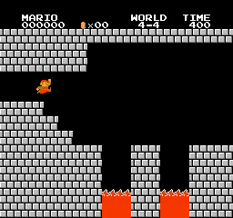 
  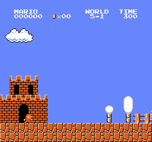
  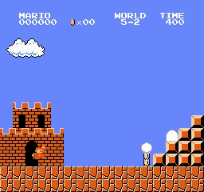
  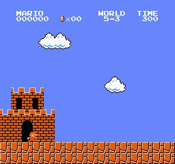
   
  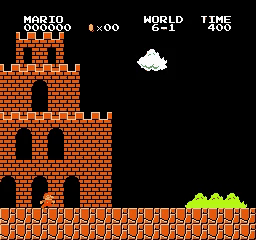
  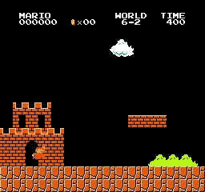
  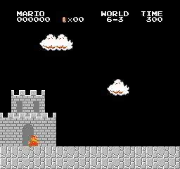
  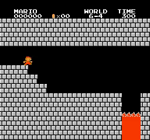 
  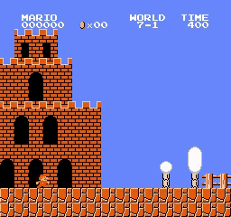
  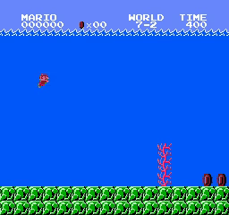
  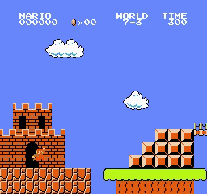
   
  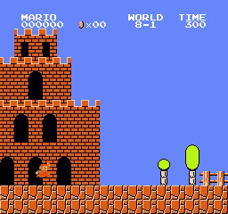
  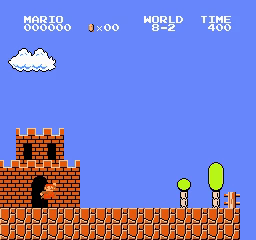
  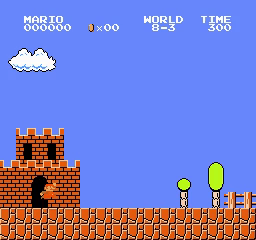
   
  <i>Results</i>

## Motivation

Most of my Mario projects are built on policy gradients (A2C, A3C, ACKTR and PPO). I've noticed these algorithms are very sensitive to hyperparameters and produce inconsistent results (simply running with different seeds will result in a low probability of completing the difficult stage). While using LSTM or adding intrinsic rewards (RND, NGU, NovelD, E3B, or RE3) can make the algorithm more stable (increasing completion probability, even to near 100%). But this is due to the added factors (LSTM or intrinsic rewards), not the inherent nature of the algorithm. I want to explore and experiment with other base algorithms like value-based or model-based. Therefore, I tried implementing R2D2. Implementing R2D2 is much more complex than PPO (the original is asynchronous with a distributed system), very difficult to code, and runs very slowly on a single computer (it can be considered an A3C style but separates the learner into a separate thread/computer instead of learning directly within the worker). I had to convert it to a synchronous version (like the A2C or PPO style).

## How to use it

You can use my notebook for training and testing agent very easy:
* **Train your model** by running all cell before session test
* **Test your trained model** by running all cell except agent.train(), just pass your model path to agent.load_model(model_path)

Or you can use **train.py** and **test.py** if you don't want to use notebook:
* **Train your model** by running **train.py**: For example training for stage 1-4: python train.py --world 1 --stage 4 --num_envs 8
* **Test your trained model** by running **test.py**: For example testing for stage 1-4: python test.py --world 1 --stage 4 --pretrained_model best_model.pth --num_envs 2

## Trained models

You can find trained model in folder [trained_model](trained_model)

## Hyperparameters

I chose the hyperparameters based on the recommendations from the R2D2 paper (for Atari). I also modified some hyperparameters due to resource limitations and to train faster. below is a detailed hyperparameter table:

| Hyperparameters | value | value in paper |
| :--- | :--- | :--- |
| **num_envs** | 16 | 256 |
| **learn_step** | 4 | 52 |
| **batchsize** | 16 | 64 |
| **gamma** | 0.997 | |
| **learning_rate** | 1e-4 | |
| **max_grad_norm** | 40 | |
| **target_update_freq** | 2500 | |
| **replay_buffer_size**| 1e5 | |
| **replay_buffer_sample_size** | 4e6 | |
| **start_learning_step** | 50000 | |
| **start_learning_sequence** | 6250 | N/A |
| **per_eps** | 1e-2 | |
| **per_alpha** | 0.9 | |
| **per_beta** | 0.6 | |
| **eta** | 0.9 | |
| **loss_type** | mse |
| **burn-in step (m)** | 40 |
| **sequence length (l)** | 40 |
| **n-steps (n)** | 5 | |

### How to find it:
- `num_envs = 16`: the same as previous projects. Set `num_envs = 256` if available. Because 256 run very slow, I decrease num_envs to 16.
- `learn_step = 4`: same as DQN. Please set to `52` if have enough time and resource to waiting. This value impact `replay ratio` (effective number of times each experienced observation is being replayed). I set this to 4 than increate `replay ratio`:
    - Maybe leak to overfiting on Per data. That might be the reason why R2D2 couldn't learn stage 8-4 (besides low num_envs).
    - Update: some new research on data efficient suggest that use higher `replay ratio` (for example, [OTRainbow](https://arxiv.org/pdf/2003.10181) update every 8 times per env step) yeild better performance. But this type of research focus on data efficient (worker better within 100K-500K env steps), not sure this work better in more than 1M-1B step like R2D2/PPO, ... (some method maybe only improve performance in early training for data efficient but can't improve when train longer).
    - I think `replay ratio` is a importance topic requiring research and experimentation that falls outside the project's scope.
- `batchsize = 16`: R2D2 paper set `batchsize = 64`, but I decrease num_envs from 256 to 16 and learn_step from 52 to 4. Then I want lower batchsize to decrease (balance) `replay ratio`. Also, decreasing batchsize can help learn faster. I'm not sure if it affects performance. If you can, please set it to 64.
- `gamma = 0.997`, `learning_rate = 1e-4`, `max_grad_norm = 40`: like R2D2 paper.
- `target_update_freq = 2500`: like R2D2 paper. Some R2D2-based algorithms reduce target_update_freq to 1500 or 2000 (NGU, Agent57).
- `replay_buffer_size = 1e5`, `replay_buffer_sample_size = 4e6`: like R2D2 paper.
- `start_learning_step = 50000`: like R2D2 and Apex paper (R2D2 paper said other hyperparameters (don't listing) are same as Apex paper).
- `start_learning_sequence = 6250`: like Agent57 paper (R2D2 paper don't mention it). But I think `start_learning_step = 50000` make model learn too soon (per have only some sequences), then I use `start_learning_sequence = 6250` same as Agent57.
- `per_eps = 1e-2`, `per_alpha = 0.9`, `per_beta = 0.6`: like R2D2 paper. This is hyperparameters for Per.
- `eta = 0.9`, like R2D2 paper. This use to balance mean and max TD error in sequence when calculate priority.
- `loss_type = mse`, like R2D2 paper.
- `burn-in step (m) = 40`, `sequence length (l) = 40`, `n-steps (n) = 5`: like R2D2 paper.

### Discuss about hyperparameters
R2D2 training is very stable, unlike PPO. Tuning some hyperparameters like `batchsize`, `learn-step`, and `num_envs` within a small range doesn't reduce performance (it just takes longer to train), according to my experiments. Therefore, I use this set of hyperparameters to train faster (completing all stages except 8-4 in a single run). 

I tried tuning `batchsize = [16, 32, 64]`, `learnstep = [4, 8, 16]`, `num_envs = [16, 32, 64]` for stages 1-3, 5-3, and 8-4. All tests completed stages 1-3 and 5-3 but failed for stage 8-4.

## Training step and training time

| World | Stage | training_step | training_time    |
|-------|-------|---------------|------------------|
| 1 | 1 | 73582 | 01:24:31 |
| 1 | 2 | 187198 | 03:59:46 |
| 1 | 3 | 898393 | 12:35:41 |
| 1 | 4 | 61997 | 01:08:21 |
| 2 | 1 | 479491 | 11:09:59 |
| 2 | 2 | 78793 | 01:41:58 |
| 2 | 3 | 145196 | 02:55:12 |
| 2 | 4 | 72798 | 01:30:12 |
| 3 | 1 | 177998 | 03:47:13 |
| 3 | 2 | 57596 | 01:14:57 |
| 3 | 3 | 241187 | 04:58:27 |
| 3 | 4 | 74795 | 01:06:04 |
| 4 | 1 | 106783 | 02:06:17 |
| 4 | 2 | 485597 | 11:14:22 |
| 4 | 3 | 854000 | 18:14:25 |
| 4 | 4 | 527197 | 12:14:09 |
| 5 | 1 | 187983 | 02:43:54 |
| 5 | 2 | 318389 | 04:38:27 |
| 5 | 3 | 871984 | 12:18:43 |
| 5 | 4 | 135993 | 01:53:23 |
| 6 | 1 | 92396 | 01:15:16 |
| 6 | 2 | 387570 | 06:02:51 |
| 6 | 3 | 528793 | 11:39:14 |
| 6 | 4 | 81200 | 01:06:10 |
| 7 | 1 | 81995 | 01:06:12 |
| 7 | 2 | 75977 | 00:56:01 |
| 7 | 3 | 295984 | 04:17:24 |
| 7 | 4 | 350750 | 05:11:21 |
| 8 | 1 | 1459579 | 1 days 01:03:44 |
| 8 | 2 | 677189 | 10:27:14 |
| 8 | 3 | 317970 | 07:02:13 |
| 8 | 4 | 0 | 0:00:00 |

## Questions and Discussion

- Is this code guaranteed to complete the stages if you try training?
    - I always complete all 31/32 stages (except 8-4) every time I run it. I think the completion rate is 100%. This is better than standard PPO/LSTM PPO (without intrinsic rewards).

- How long do you train agents?
    - From a few hours to one day. The training time depends on the hardware. I use many different hardware configurations, so the time will not be accurate.

- How can you improve this code?
    - You can separate the agent evaluation part into a separate thread or process. I'm not very experienced with multithreaded programming, so I didn't do this.
    - Implement R2D2 instead of SR2D2.
    - Tuning hyperparameters.

- Why pretrained weights can't complete stage?
    - Because of different packages, sometimes pretrained programs will behave differently and not complete the stage (e.g., running on Colab). Make sure your settings match mine. However, if you train from scratch or use my code, it shouldn't be affected.
    - I use vastai/pytorch:cuda-x-auto docker (x from 12.8.1 to 13.2.1, Other versions x that are close to the one I listed still work.). And then pip install requirement.

- How should hyperparameters be tuned?
    - Please reread the hyperparameters section. Tunning at a small scale hardly improves anything. If possible, use the original hyperparameters in the paper (if resources are large enough, using a distributed system as in the paper will be faster).
    - Maybe you need change batchsize, learn-step to yeild higher or smaller `replay ratio`.

- About `replay ratio`?
    - Apex, R2D2, NGU and Agent57 is use a lot of worker and use low `replay ratio`. This prevent overfit and maybe make model still improve performance when training longer. As PPO with lower epoch.
    - But some new research on data efficient suggest use higher `replay ratio` to yeild better result. But not sure this will make model converge to local minima.
    - I think we need increase or decrease `replay ratio` too much because I see my PPO and SR2D2 not improve after 1-3M steps if model is converge to local minama (maybe overfit with normal `replay ratio`). Than we need increase `replay ratio` to learn faster (don't waste resource) and yeild higher performance within 1M steps. Or decrease `replay ratio` too much (like `learn-step = 52` as paper) to prevent overfit (make model still improve when stuck at local minama).
    - I think need to try both:
        - If you want model learn faster, maybe I need increase `batchsize = 64` and `learn-step >= 4`. It still help improve performance within 100K-1M steps.
        - If you want better performance for long training, maybe you need decrease `learn-step = 52` as paper.

- What are the differences between SR2D2 and R2D2?
    - Use a different set of hyperparameters.
    - SR2D2 only runs on one machine, so scaling resources and hyperparameters will not be as efficient as R2D2 running on multiple machines.
    - Per is coded differently:
        - There are several ways to implement Per for R2D2:
            - The easiest way is to save each sequence separately. When the environment rollout reaches the required steps, push it directly to Per. This is the easiest way to code, but it will overlap the burnin and n-steps, leading to double the memory usage. With R2D2, the work runs synchronously, so one worker might have finished an episode while others haven't. This needs careful handling. Sequences also need to ensure there are no terminal states in between, so careful masking or special handling of sequences with terminal states in between is necessary.
            - An improved version of the above method: only save the training sequence (avoiding overlap). Point the burnin and n-steps to a different index sequence. This method is more difficult to code but optimizes memory usage. This method still requires careful handling of the terminal state in the middle of the sequence.
            - Save by episode. This is how I do it. When the environment rollout finishes an episode, push it to Per. Per will receive the index where each sequence starts to build the sumtree (an episode can have many overlapping sequences). When sampling, the process relies on the starting index of the sequence to retrieve that sequence. The limitation of this method is that data is only pushed into the program at the end of each episode, instead of when the sequence is complete.
            - You can refer to another implementation: [ZiyuanMa R2D2](https://github.com/ZiyuanMa/R2D2/tree/main).
        - Regarding the terminal state in the middle of the sequence, there are several different solutions:
            - Ignore it. Training will proceed normally; just reset the lstm hidden state after the terminal step. However, R2D2 ensures the sequence doesn't have a terminal, so this might affect performance.
            - Discard that sequence. Data will be lost. It's not certain if this will affect performance; it probably depends on the environment, which usually has long or short episodes.
            - Mask the steps after the terminal state of the sequence. Push the steps after the terminal state into the next sequence. Training will work normally, but the loss calculation will not use the masked samples. I use this solution.
            - I'm not sure if R2D2 uses method 2, 3, or another approach.
        - I'm not sure how R2D2 builds per (I use method 3, saving by episode). For the worker synchronization issue, I use method 3 to solve it (masking after the terminal state and pushing that part into the sequence later).
    - I use online model to select actions and calculate PER priority when R2D2 use actor/worker model (This is not online or target model as discuss above).
    - Because of the way I coded it, the worker will only push data into per when the episode ends, and R2D2 will push it into per when the sequence is complete.
    - r2d2 runs each worker on a separate thread. Sr2d2 runs them simultaneously. You can think the difference like A3C and A2C:
        - r2d2 will only load the global model after 400 steps (each worker/actor have their own worker/actor model). Sr2d2 will always use the global model (not use worker/actor model). This can also impact performance:
            - r2d2 runs multiple (closely related) versions of the global model, so the data is more diverse.
            - But because of this, the data may be noisy or outdated.
            - It's not certain whether this is an advantage or a disadvantage. Like A2C and A3C, performance will vary depending on the environment.
        - R2D2 runs as an independent learner, not dependent on workers collecting data. It continuously trains regardless of the workers. Therefore, they try to synchronize the ratio of 52 environment steps/update by limiting resources/computers to run at 260 environment steps/second and update 5 times/second.
        - SR2D2 runs alternately. Once the worker collects 4 (52 if according to the paper) steps, the learner trains the model and repeats the process.

- Compare with PPO and LSTM PPO?
    - Harder to implement:
        - Need additional code for `per`. 
        - This handles sequences with terminal state (padding sequences).
        - One of the unique advantages of R2D2 over LSTM PPO is its distributed nature, easier to implement LSTM:
            - Each worker uses only one environment and samples data from per instance, making it easier to manage. Although R2D2 also faces some challenges, such as varying episode lengths for workers or handling terminal state, it offers only a few options.
            - LSTM PPO has many different implementations and no specific baseline. If LSTM is not used effectively, LSTM PPO will perform worse than a normal PPO.
    - Stability:
        - R2D2's performance is more stable. It completes all stages except 8-4 in every run with several different hyperparameter sets.
        - PPO/LSTM PPO will show very different performance between runs (sometimes very fast (tens of thousands of steps), sometimes very slow (millions of steps), and sometimes it doesn't work). But because of this instability, you might sometimes be lucky enough to complete a difficult stage due to this randomness (low probability of completion).
    - Hyperparameter sensitivity:
        - PPO is very sensitive to hyperparameters, as in the projects I've tested.
        - LSTM PPO is even more sensitive because there are many ways to implement LSTM, and these can reduce performance (compare with normal PPO).
        - R2D2 is less sensitive; as in some tests in the hyperparameter section, it always works well.
    - Difficult to reproduce:
        - Papers on PPO usually use 7-32 environments (at most 128, but few papers use 128 environments), so I can easily reproduce them.
        - R2D2 uses 256 workers and takes a very long time to train, so I can almost not reproduce it.

## Requirements

* **python 3>3.6**
* **gymnasium==0.29.1**
* **gym-super-mario-bros==7.4.0**
* **gym==0.25.2**
* **imageio**
* **imageio-ffmpeg**
* **opencv-python-headless**
* **pytorch** 
* **numpy==1.26.4**

## Acknowledgements
With my code, I completed all 31/32 stages of Super Mario Bros, except stage 8-4.

## Reference
* [Howuhh PER](https://github.com/Howuhh/prioritized_experience_replay/blob/main/memory/buffer.py)
* [ZiyuanMa R2D2](https://github.com/ZiyuanMa/R2D2/tree/main)
* [CVHvn A2C](https://github.com/CVHvn/Mario_A2C)
* [Stable-baseline3 ppo](https://stable-baselines3.readthedocs.io/en/master/_modules/stable_baselines3/ppo/ppo.html#PPO)
* [uvipen PPO](https://github.com/uvipen/Super-mario-bros-PPO-pytorch)
* [lazyprogrammer A2C](https://github.com/lazyprogrammer/machine_learning_examples/tree/master/rl3/a2c)
